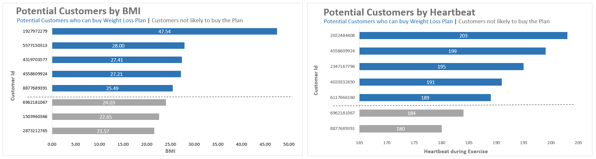
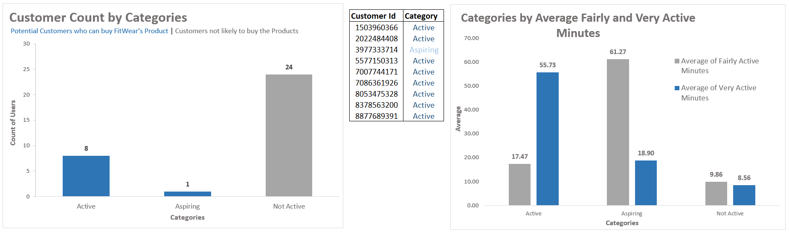
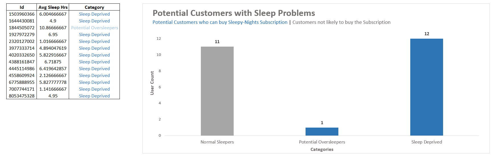
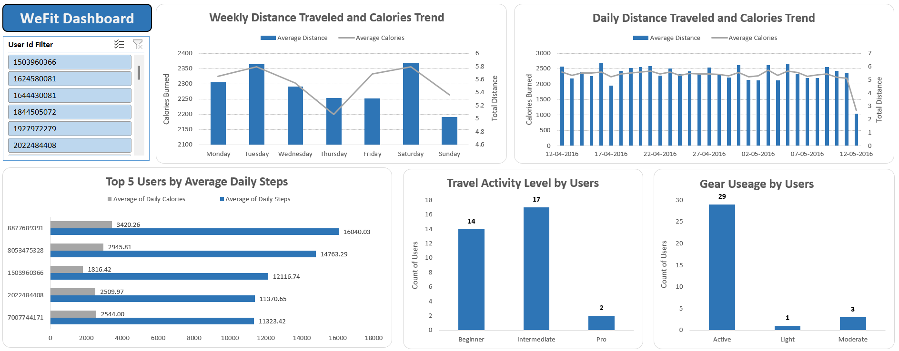

# WeFit Fitbit Fitness Tracker Analysis

Excel-based analysis of Fitbit fitness tracker data to identify potential customers for three WeFit subsidiaries (LeanFit, FitWear, Sleepy-Nights) and build a management dashboard from daily activity data.

## Business context

WeFit is a fitness company with three subsidiaries: LeanFit (personalized diet plans), FitWear (fitness apparel and gear), and Sleepy-Nights (a sleep-tracking subscription app). Each subsidiary needed customer targeting based on real usage data, and the analytics team needed a dashboard summarizing overall device usage trends.

## Data source

FitBit Fitness Tracker Data, sourced from Kaggle and released under CC0: Public Domain. Data was collected from 30 consenting Fitbit users via Amazon Mechanical Turk between 12 March and 12 May 2016, covering minute-level physical activity, heart rate, and sleep monitoring.

## Repository structure

```
wefit-fitbit-analysis/
├── README.md
├── analysis/
│   ├── Task_1_LeanFit_Analysis.xlsx
│   ├── Task_2_FitWear_Analysis.xlsx
│   ├── Task_3_SleepyNights_Analysis.xlsx
│   └── Task_4_Final_Analysis_Dashboard.xlsx
└── screenshots/
    ├── task1_leanfit_charts.png
    ├── task2_fitwear_charts.png
    ├── task3_sleepynights_charts.png
    └── task4_dashboard.png
```

## Methodology

### Task 1 — LeanFit: who's likely to buy the weight loss plan

Two independent criteria were applied, since they come from separate datasets.

BMI: customers with BMI between 25 and 30 (overweight) or 30+ (obese) were flagged from the weight log data, since this range is when a weight loss plan is medically relevant.

Heart rate: customers whose heart rate exceeded 185 bpm during recorded activity were flagged, since sustained high heart rate is linked to hypertension risk, which weight loss helps mitigate.

Output: two separate customer ID lists, one per criterion, in `Final Solution`.



### Task 2 — FitWear: who's likely to buy fitness gear

Customers were segmented into three tiers using days of tracker use and activity minutes:

- **Active**: tracked for 20+ days, averaging 30+ very active minutes/day (already fitness-committed, likely to upgrade gear)
- **Aspiring**: tracked for 20+ days, averaging 60+ fairly active minutes/day (getting into fitness, likely to buy starter gear)
- **Not Active**: everyone else

Output: customer list with category labels, plus a column chart showing the distribution.



### Task 3 — Sleepy-Nights: who's likely to subscribe

Customers were segmented by average nightly sleep hours, using the commonly cited 7–9 hour healthy range:

- **Sleep Deprived**: average < 7 hours
- **Normal Sleepers**: 7–9 hours
- **Potential Oversleepers**: average > 9 hours

Sleep Deprived and Potential Oversleepers are both flagged as target customers, since both groups have irregular sleep patterns the app is designed to fix.



### Task 4 — Dashboard: overall usage trends

Daily activity data was cleaned and aggregated two ways:

1. **By user ID** — days tracked, usage tier (Active >20 days / Moderate 10–20 / Light <10), average daily distance, distance tier (Beginner / Intermediate / Pro), total steps, total calories, and activity-minute breakdowns per user.
2. **By date** — the same metrics aggregated across all users per calendar day, to see how overall engagement moved over the survey period.

Pivot tables were built from both aggregations and combined into a single dashboard sheet for a non-technical management audience.



## Tools used

Microsoft Excel — VLOOKUP/XLOOKUP, IF/nested IF for segmentation logic, PivotTables, and native charts. No external BI tool was used; the goal was to show the analysis is reproducible in a tool any business stakeholder already has.

## Key limitations

The sample is 30 users self-selected via Amazon Mechanical Turk in 2016, which is small and not demographically representative — findings should be read as a methodology demonstration, not a market-sized recommendation. Segmentation thresholds (e.g., BMI 25/30, sleep 7/9 hours, 20-day usage cutoff) follow the criteria given in the case brief; where the brief left it open, the assumption is stated explicitly in the relevant workbook.

## How to explore this project

Each `Task_*.xlsx` file is self-contained: open it and start on the **Final Solution** (or **Dashboard**) tab, which states the question, the criteria used, and the resulting customer list or chart. Earlier tabs in each file show the raw-to-clean data pipeline and the formulas behind the segmentation.
